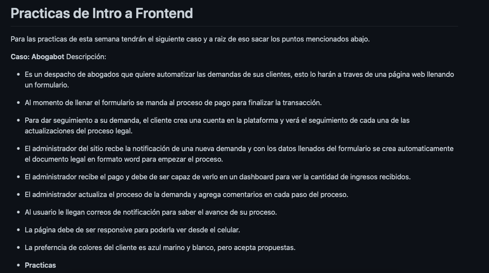
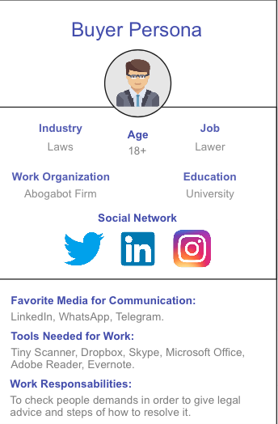
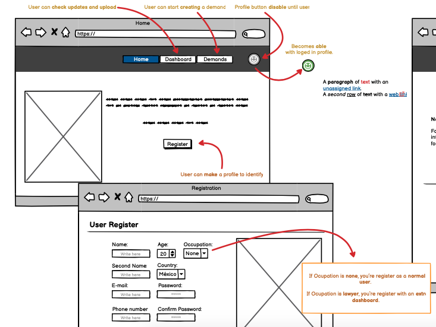
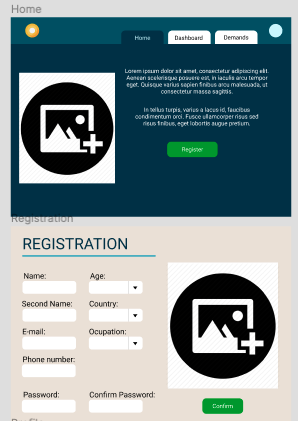

# FrontEnd Documentation
Documentation is the most important thing to do before getting into code.

This is a step by step task. *ALL LINKS ARE BELOW ALL EXPLANATION*.

## Have a case to work with :page_facing_up:
The first thing to do is having a case in wich we (developers) need to solve or automatize using our software skills.

Our MC(Mission Commander: romarlpla) gave us an specific situation to work with:

*Abogabot case, See: [romarpla practice repo](https://github.com/LaunchX-InnovaccionVirtual/FrontEnd-Mision/tree/main/01%20-%20INTRO/practicas)*

With this case in mind we need to extract some information in order to create our documentation with detail.
***
## Take Requirements
This step requires analysis and a little imagination in order to realize what tasks we´re going to implement in our present code and its future.

> I made this step in a word document you can look at: [Requirements.pdf](./Abogabot_Project.pdf)

## Create a Buyer Persona :raising_hand:
We need to create an ideal client with ideal features so that our program is directed to a specific and posible costumers to whom you can sell it.

You can create one or make someone fills information that is closest to your ideal client.

> I used Miro board app for this step.

*Buyer Persona and Target Client ([Miro Board](https://miro.com/app/board/uXjVOLCMEIg=/?invite_link_id=928915600067))*

## Know your Target Client

To create our Target Client we must determine characteristics such as: demographic, psycographic, geographic, etc.

With this information we can determine our specific costumer groups. ***This is going to help us give a better UX/UI service when testing and delivering our software.***

> You can look up my board in Mirio here: [Miro Board](https://miro.com/app/board/uXjVOLCMEIg=/?invite_link_id=928915600067)

## UX Wireframe :pencil:
Creating a UX Wireframe will help us and other members in a team understand how our software is planned to work.
> I used Balsamiq to explain how my software is going to work in an easy way.

> Here is my Balsamiq UX: [Balsamiq UX](https://balsamiq.cloud/s8fiw3a/pduk0iq)

## Creating a UI :art:
Last step is the UI, this step requires a lot of design knowledge cause we´re going to put colors, text fonts, shapes, etc. as we want our software to look like.

> This step is the basis when starting programming our software.

> Look up the UI in: [Figma UI](https://www.figma.com/file/7qvhrxKVJhBXichnmnpxXy/Abogabot?node-id=0%3A1)

# That`s all :smile:
This is some basic documentation in order to create a great UX/UI experience since the beginning. :neckbeard: :computer:

All links to my documentation:
- [Requirements](./Abogabot_Project.pdf)
- [Buyer Persona & Target Client](https://miro.com/app/board/uXjVOLCMEIg=/?invite_link_id=928915600067)
- [Balsamiq UX](https://balsamiq.cloud/s8fiw3a/pduk0iq)
- [Figma UI](https://www.figma.com/file/7qvhrxKVJhBXichnmnpxXy/Abogabot?node-id=0%3A1)
